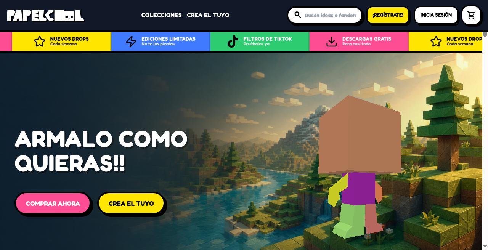
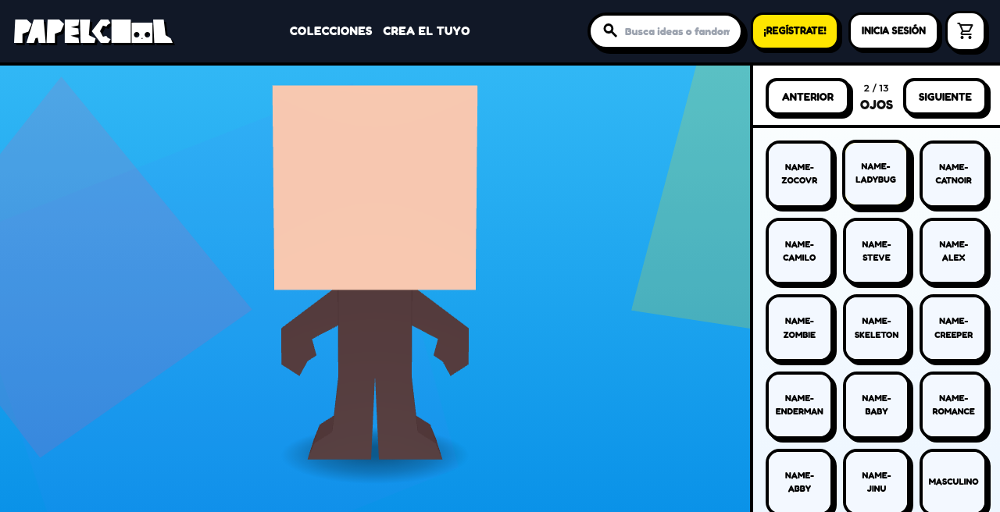
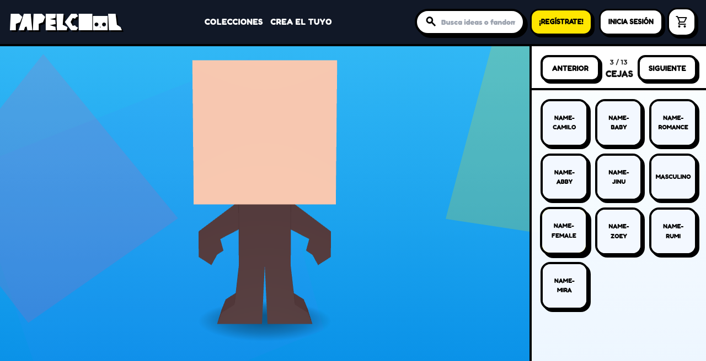

# Papelcool

**Editor 3D interactivo de personajes en estilo papercraft.** Personaliza personajes en el navegador, explóralos en 3D y crea plantillas asociadas.

## Demo en vivo

### [papel.cool](https://papel.cool)

Abre la web y prueba el editor sin instalar nada.

## Capturas

| Landing | Editor (ojos) | Detalle (cejas) |
|:---:|:---:|:---:|
|  |  |  |
| Página de inicio | Editor 3D: ojos | Editor 3D: cejas |

## Características

- Editor 3D en tiempo real con Three.js
- Personalización de personajes y presets
- Modo foto con encuadre uniforme y descarga cuadrada en alta resolución
- Modo juego con controles de movimiento
- Interfaz responsive, optimizada para escritorio y móvil
- Flujos de autenticación, pago y generación de plantillas en el entorno desplegado

## Stack

- **Three.js** (WebGL) — escena y personaje 3D
- **HTML / CSS** — interfaz y estilos compilados
- **JavaScript** (vanilla) — lógica de la aplicación

## Desarrollo local

Necesitas Node.js. Instala las dependencias y compila los estilos:

```bash
npm install
npm run build:css
```

Sirve el proyecto con un servidor HTTP local; no abras `index.html` con `file://`, porque CORS y los recursos 3D fallan. El CSS generado queda en `assets/css/tailwind.css`. Opcionalmente, `npm run watch:css` recompila los estilos al cambiarlos.

## Despliegue y servicios

- **Hosting:** Cloudflare Pages; dominio público `papel.cool`.
- **PDFs de presets (R2):** la Function `/api/preset-template-download` lee PDFs mediante el binding R2 privado `PRESET_PDFS_BUCKET`. El prefijo predeterminado es `presets-pdfs/`; configura `PRESET_PDFS_PREFIX` si usas otro. No expongas el bucket ni sus URLs directas. En desarrollo local puede usarse `PRESET_PDFS_DEV_BASE_URL`.
- **Plantillas custom y Stripe:** Cloudflare Functions usan `TEMPLATE_GENERATOR_URL`, `TEMPLATE_GENERATOR_SECRET` y el binding KV `PAPELCOOL_STRIPE_ACCESS_KV`. Los endpoints `/api/custom-template-job` y `/api/custom-template-download` crean y descargan los trabajos. El secreto solo debe existir en Cloudflare y en el servicio generador, nunca en el frontend.
- Consulta `OPTIMIZACIONES_MOVILES.md` para detalles técnicos de rendimiento móvil y `PROJECT_CONTEXT.md` para el contexto del producto.

## Fourthwall y YouTube Shopping

Papelcool consume el catálogo público de Fourthwall mediante su feed JSON. Las tarjetas usan la interfaz existente de la web; al pulsar un producto, se abre su ficha y checkout de Fourthwall, donde se entrega el PDF digital. No se guarda ningún token de Fourthwall en el navegador.

Para conectar la tienda:

1. Crea la tienda en Fourthwall y publica tus productos PDF en **Dashboard → Products**.
2. Define `FOURTHWALL_STORE_URL` con la URL pública, por ejemplo `https://tu-tienda.fourthwall.com`.
3. Opcionalmente, define `FOURTHWALL_COLLECTION`; por defecto se usa `all`.
4. Arranca el servidor local con `node dev-server.mjs` y abre `/?view=shop`.
5. En producción, configura las mismas variables en Cloudflare Pages. La Function `/api/fourthwall/products` consulta `/collections/all.json`, normaliza precios e imágenes y devuelve los campos necesarios para Papelcool.

Mientras `FOURTHWALL_STORE_URL` no esté configurada, Tienda muestra los presets locales como respaldo visual. La compra y entrega digital ocurren en Fourthwall. Para YouTube Shopping, conecta el canal desde **Fourthwall → Apps → YouTube** y completa la revisión de elegibilidad de YouTube.

Documentación: [feed de catálogo](https://docs.fourthwall.com/shop-apis/shop-feeds), [productos digitales](https://docs.fourthwall.com/guides/create-digital-products), [integración con YouTube](https://fourthwall.com/features/apps-and-integrations/youtube-merch-shelf) y [precios](https://fourthwall.com/pricing/).

## Licencia / uso

Proyecto personal de portfolio. Revisa el repositorio para el estado actual del código y de la demo.
